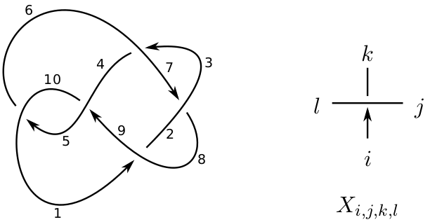

# jones-polynomial
The [Jones Polynomial](https://en.wikipedia.org/wiki/Jones_polynomial) is a knot/link invariant. This program is the direct implementation of the mathematical definitions in Haskell and can be used for calculation.

I implemented the code as a part of my bachelor thesis.

## Usage
In order to feed a knot diagram into the program, it has to be into a string of certain format. To do so every edge in a knot diagram is assigned a number. If the diagram is oriented then for each crossing there is an edge pointing at the crossing. This is depicted in the following image.



A single crossing can then be encoded by enumerating the numbers of the adjacent edges, going counter-clockwise starting with the edge pointing toward the crossing. The whole link or knot is then encoded simlpy by the list of all the encoded crossings. In the above example we would obtain the following string representation of the knot

```haskell
knot = [ X[1,8,2,9], X[7,2,8,3], X[3,6,4,7], X[5,10,6,1], X[9,4,10,5] ].
```

The calculation of the (unnormalized) jones polynomial is know as simple as typing
```haskell
> unnormalized_jones_polynomial knot
```
yielding the output
```haskell
-1X^-13 + 1X^-7 + 1X^-5 + 1X^-1.
```